# 🍽️ DineFloww — App Showcase

A visual showcase of **DineFloww**, a native Android Restaurant Management System built to simplify restaurant operations including menu management, inventory tracking, orders, billing, staff management, and role-based access.

> This repository contains **screenshots and promotional previews only**.  
> The main application source code is maintained separately.

---

## ✨ About DineFloww

DineFloww is designed as a production-oriented Android application for managing restaurant workflows from a single platform.

### Core Features

- Authentication & Restaurant Setup
- Owner Dashboard
- Menu Management
- Inventory & Stock Tracking
- Order Management
- Billing & Payments
- Bill History
- PDF Invoice Generation
- Staff Management
- Role-Based Access Control
- Owner / Waiter / Chef workflows

---

## 📱 App Screens

### Overview
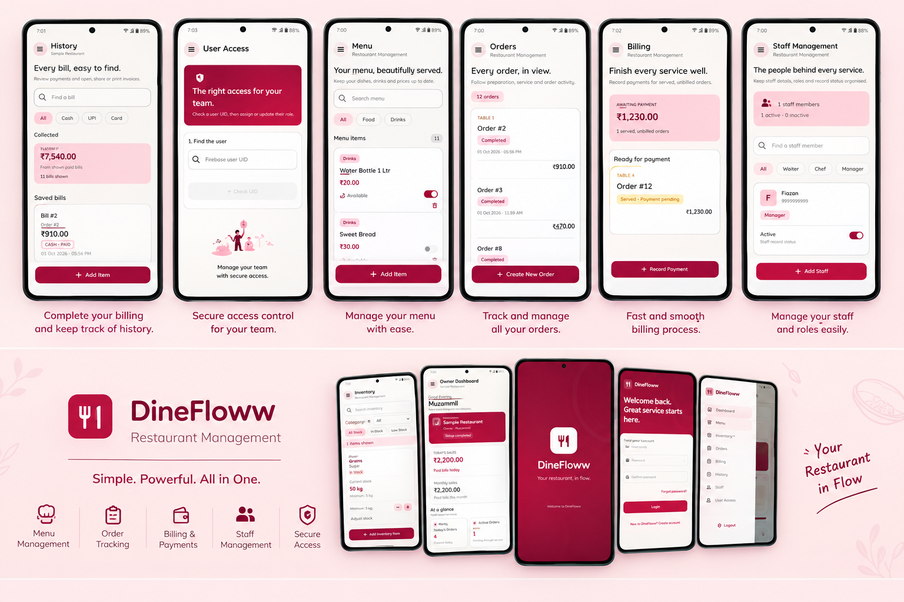

### Splash Screen
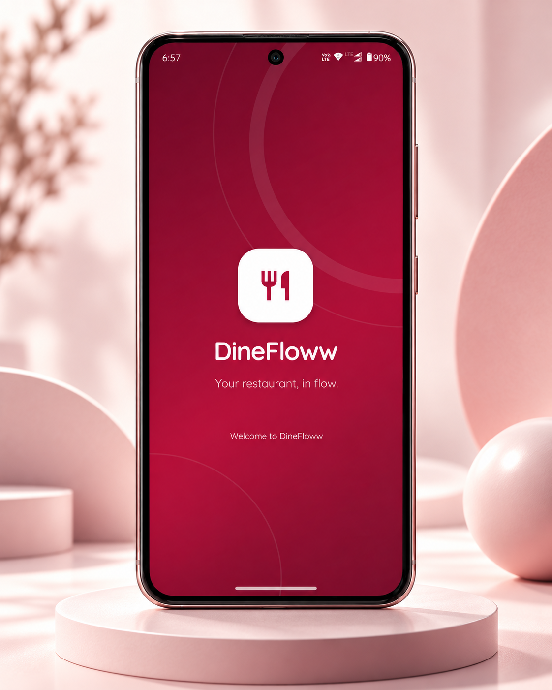

### Login
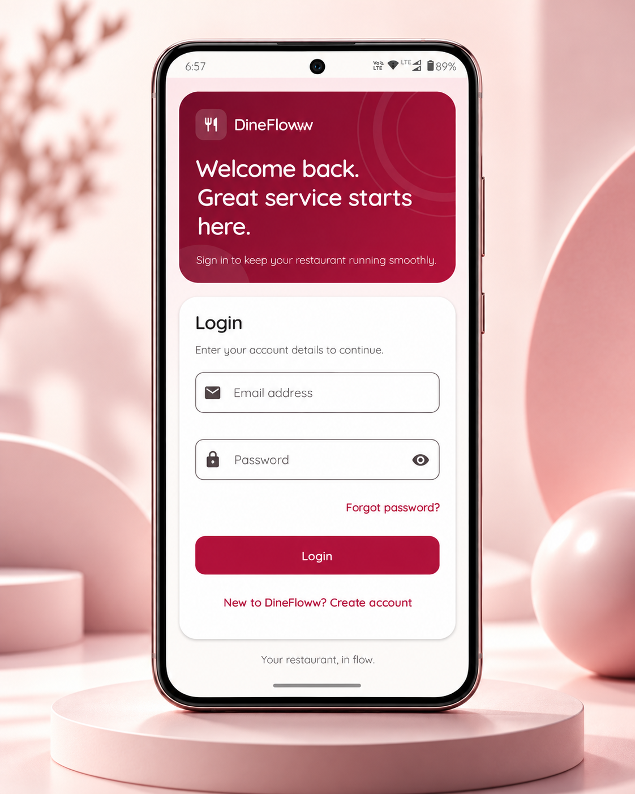

### Create Account
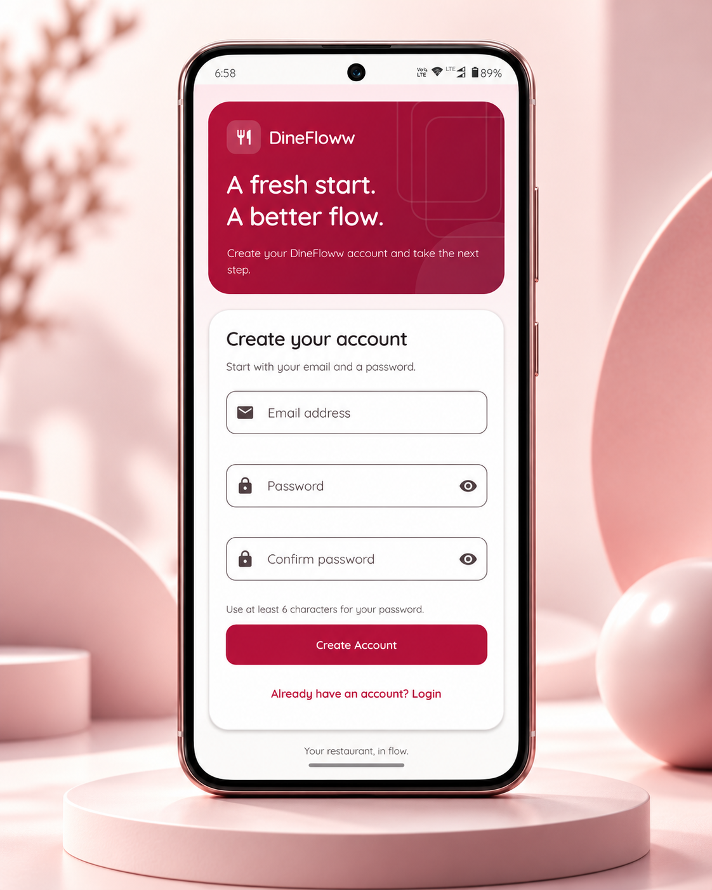

### Owner Dashboard
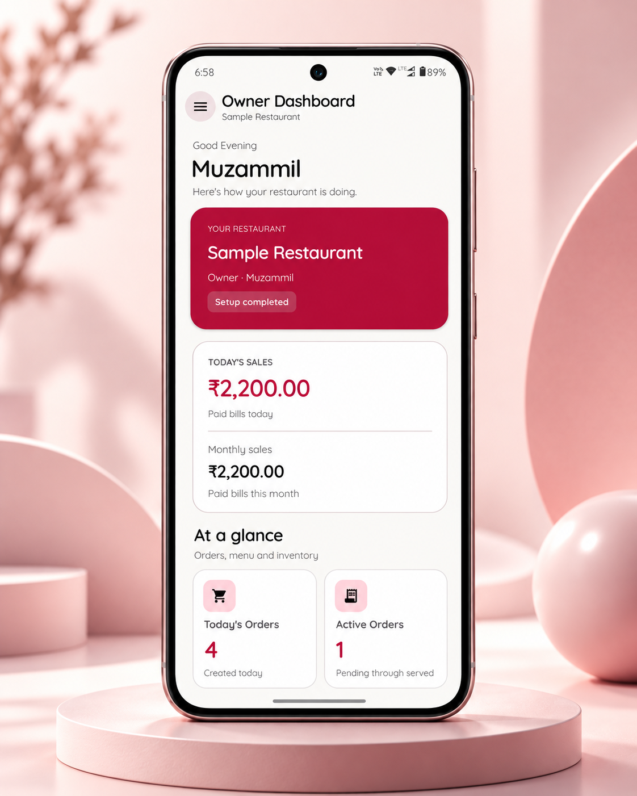

### Menu Management
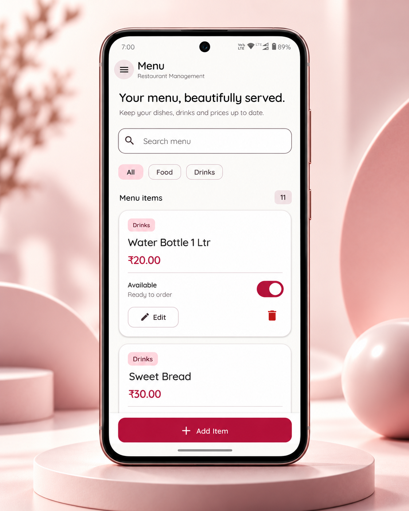

### Inventory Management
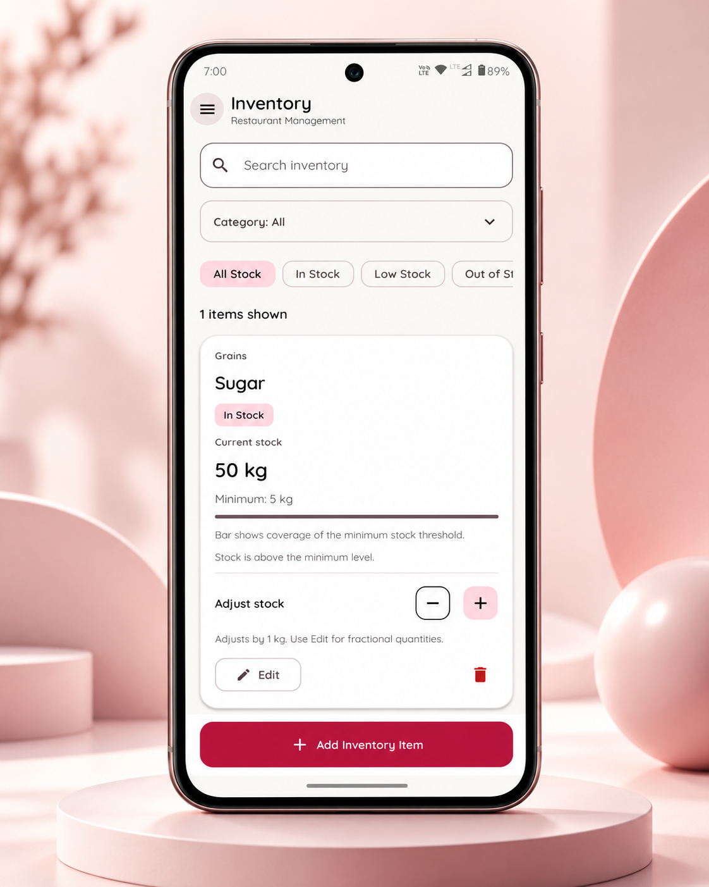

### Orders
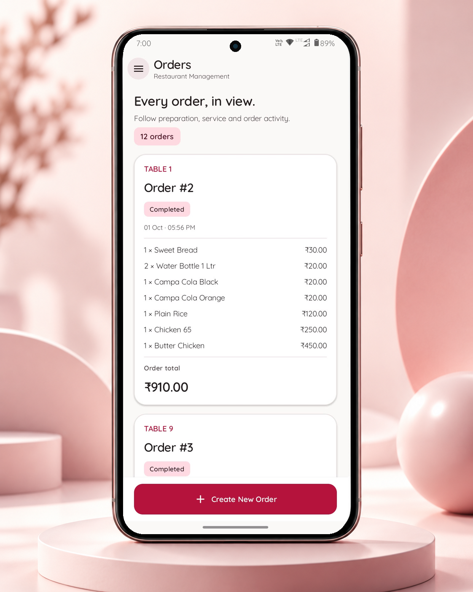

### Billing
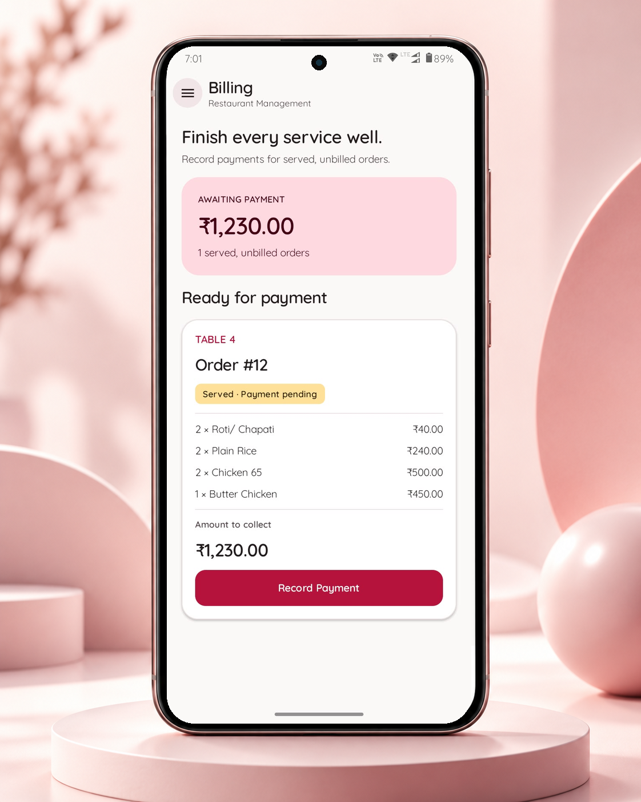

### History
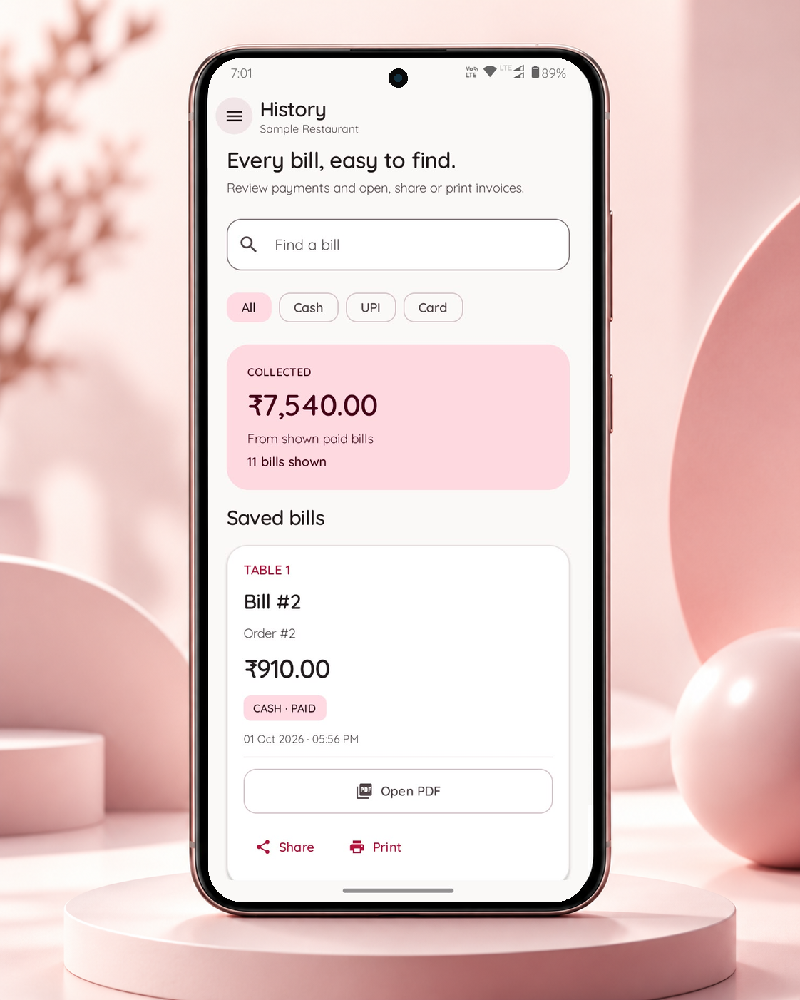

### Staff Management
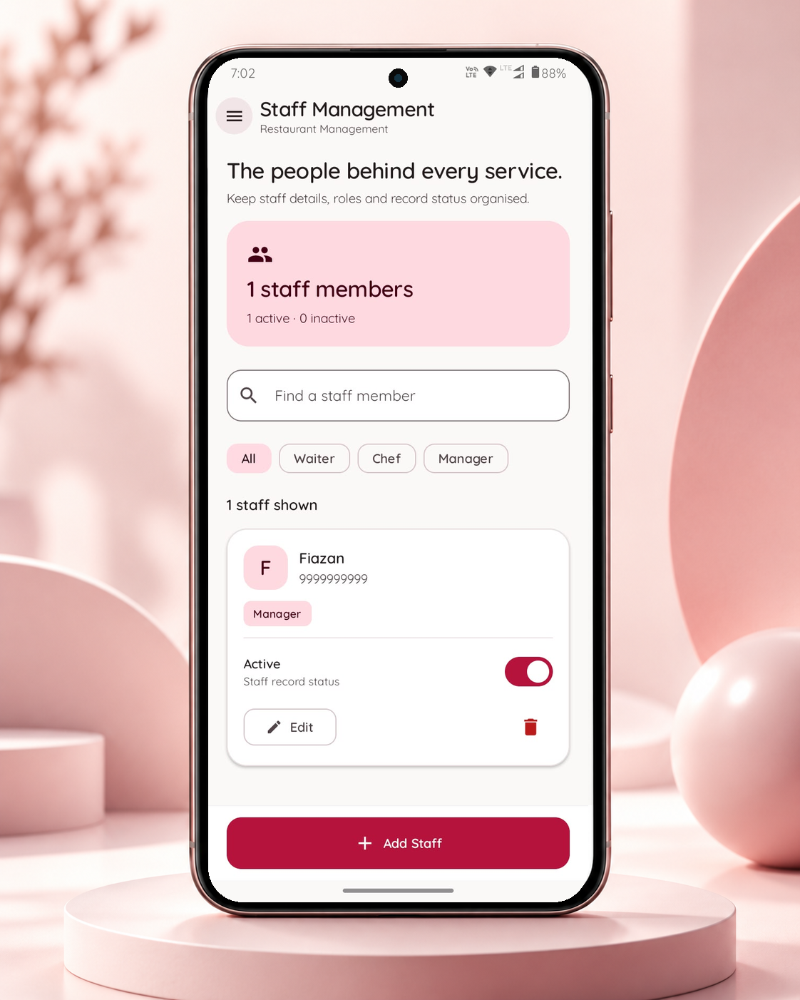

### User Access
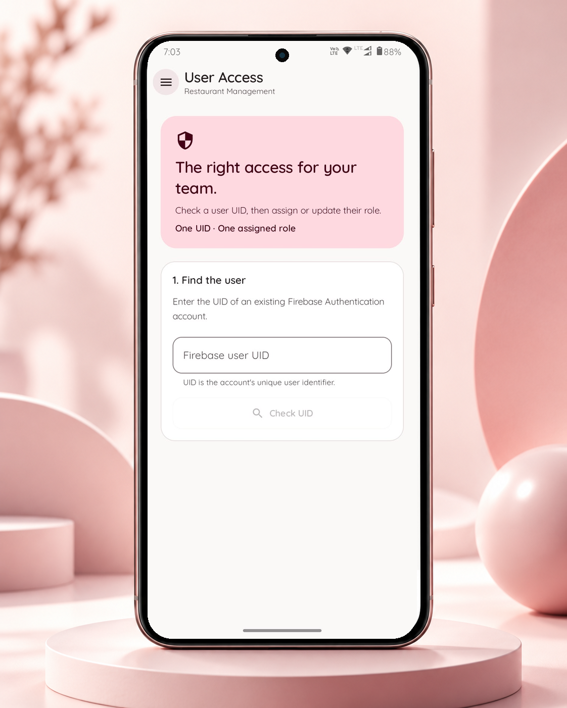

---

## 🛠️ Tech Stack

- **Kotlin**
- **Jetpack Compose**
- **MVVM**
- **Clean Architecture**
- **Repository Pattern**
- **Hilt / Dagger**
- **Room Database**
- **Coroutines & Flow**
- **Firebase**
- **Git / GitHub**
- **CI/CD**

---

## 🎯 Project Focus

DineFloww was developed with focus on:

- Clean and modular architecture
- Scalable Android development
- Role-based workflows
- Smooth and responsive UI
- Local data persistence
- Real-world restaurant operations
- Maintainable and testable code

---

## 🔗 Main Project

The complete DineFloww Android project is available here:

**GitHub:**  
[View DineFloww Source Repository](YOUR_MAIN_REPOSITORY_LINK)

---

## 👨‍💻 Developer

**Sayyad Mujjamil**

Android Software Engineer

**Kotlin | Jetpack Compose | MVVM | Clean Architecture | Room | Firebase | Hilt | CI/CD**

---

## 📌 Note

This repository is intended only for **project presentation, UI showcase, and portfolio purposes**.

---

### DineFloww

**Your restaurant, in flow.**
